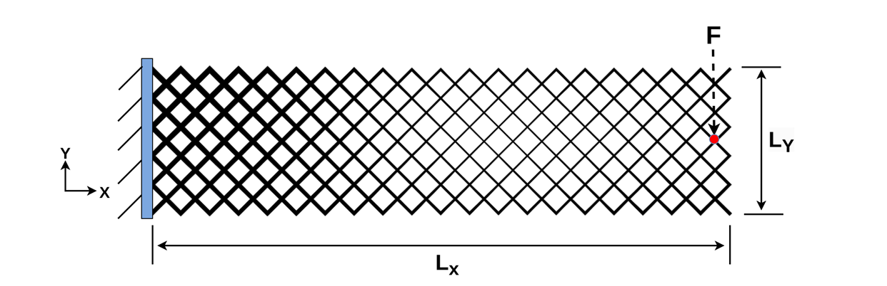
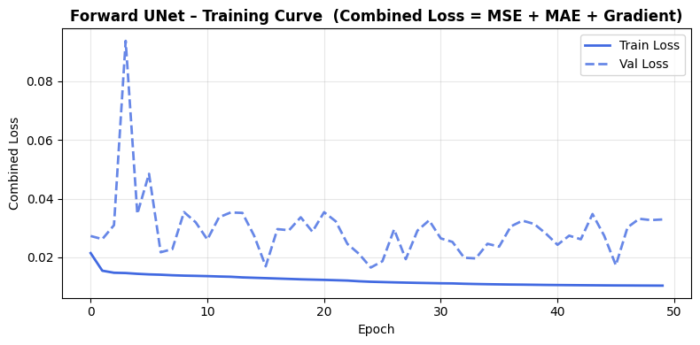
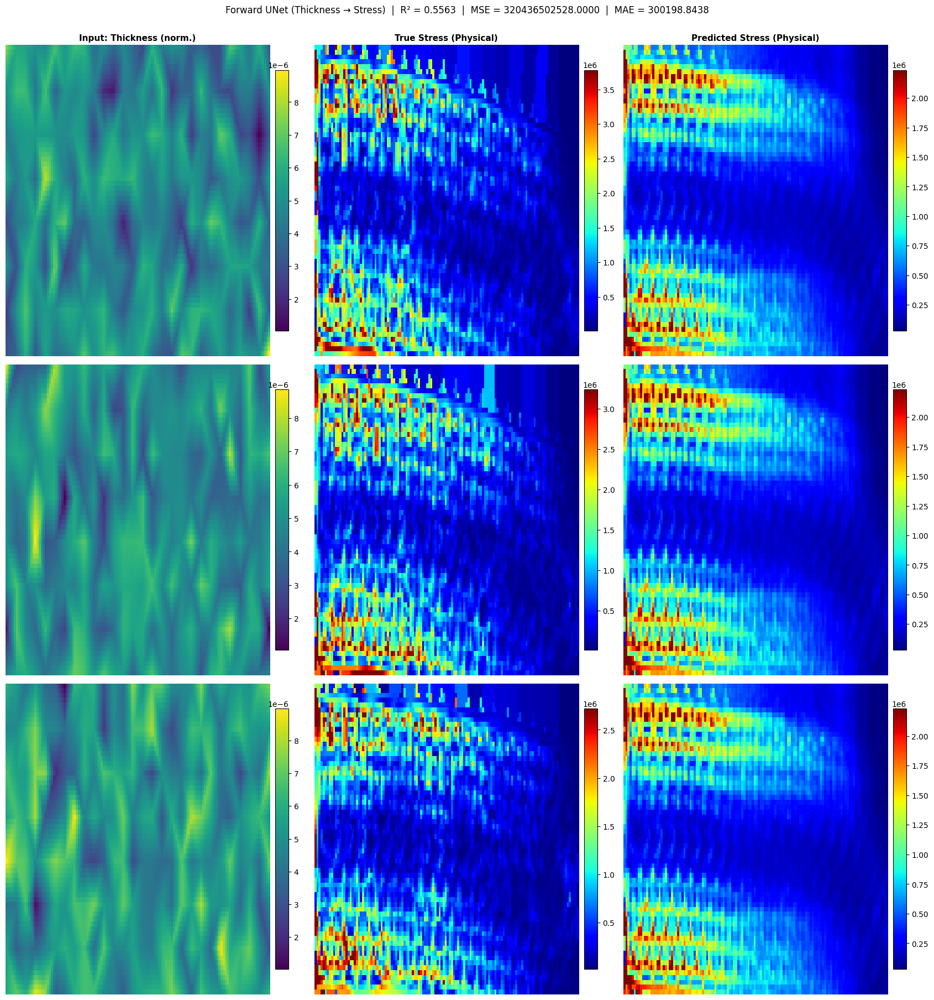
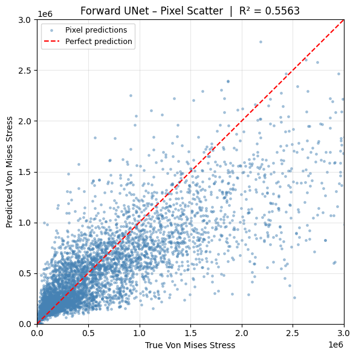
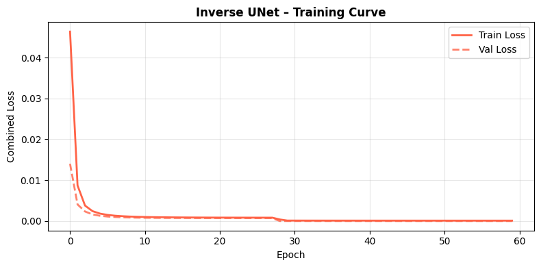
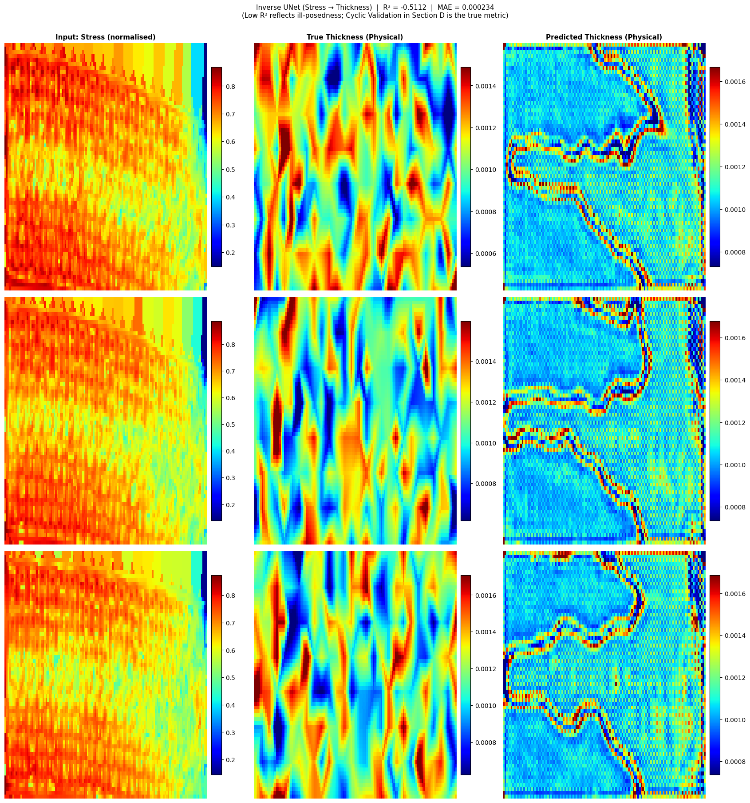

# Forward + Inverse UNet for Cantilever Beam Stress Prediction

This project looks at a cantilever beam made of centered rectangular unit cells, fixed at one edge with a single point load applied at the mid-right edge. Every strut in the lattice can have a different thickness, and the goal is to understand how the thickness distribution across the structure affects the resulting Von Mises stress field.



Two UNets are trained here:

- A **forward model** that takes a thickness distribution and predicts the Von Mises stress field.
- An **inverse model** that goes the other way — takes a stress field and predicts a thickness distribution.

The forward direction is a well-posed simulation: one thickness field always produces the same stress field. The inverse direction is not — many different thickness fields can produce nearly the same stress field, so the inverse model has no single correct answer to converge to. Because of this, its direct accuracy is expected to be low, and the real way to judge whether it learned anything useful is a cyclic check: take a stress field, run it through the inverse model to get a thickness field, then run that thickness field back through the forward model and see how close the reconstructed stress is to the original.

## Dataset

- `output.xlsx` — 5000 rows, 226 columns. Each row is one strut-thickness profile, one value per node.
- `stress/` — 5000 text files, one per row of `output.xlsx`. Column 1 is Von Mises stress, columns 2 and 3 are the deformed X and Y coordinates.
- `cord.txt` — X and Y coordinates of the undeformed structure, used to lay out the 226 node positions.

Both the thickness values and the stress values are scattered points, so they get interpolated onto a shared 64×128 pixel grid before being fed into the UNets as images.

## Repo structure

```
├── dataset/
│   ├── output.xlsx
│   ├── cord.txt
│   └── stress/
├── src/
│   ├── config.py
│   ├── utils.py
│   ├── data_processing.py
│   ├── unet_architecture.py
│   ├── forward_model.py
│   ├── inverse_model.py
│   └── cyclic_validation.py
├── outputs/
│   ├── models/
│   ├── forward/
│   ├── inverse/
│   └── cyclic/
├── results/
│   ├── forward/
│   ├── inverse/
│   └── cyclic/
├── beam.png
├── main.py
└── requirements.txt
```

`outputs/` is where a run of `main.py` writes plots and model weights fresh every time. `results/` holds the plots picked out from the best run — the ones that actually get committed and shown here.

## Setup

```bash
python -m venv venv
venv\Scripts\activate
python -m pip install --upgrade pip
python -m pip install -r requirements.txt
```

Drop the dataset into `dataset/` before running anything, matching the structure above.

### GPU on Windows

Native Windows TensorFlow builds lost GPU support after version 2.10, so GPU acceleration now needs WSL2:

```bash
wsl --install
```

Reboot, then inside Ubuntu:

```bash
nvidia-smi
```

should show the GPU with no extra driver install needed — it rides on the existing Windows NVIDIA driver. TensorFlow currently supports Python 3.10–3.13, so if Ubuntu's default Python is newer:

```bash
sudo add-apt-repository ppa:deadsnakes/ppa -y
sudo apt update
sudo apt install python3.12 python3.12-venv python3.12-dev -y
```

Then set up the environment and install TensorFlow with CUDA support:

```bash
cd /mnt/d/ME504_UNet_Pipeline
python3.12 -m venv venv_wsl
source venv_wsl/bin/activate
pip install --upgrade pip
pip install tensorflow[and-cuda]
pip install -r requirements.txt
```

Check it worked:

```bash
python -c "import tensorflow as tf; print(tf.config.list_physical_devices('GPU'))"
```

## Running

```bash
python main.py
```

This loads and grids the data, trains the forward UNet, trains the inverse UNet, then runs the cyclic validation loop and saves every plot along the way.

The forward model uses a combined loss — MSE plus MAE plus a gradient penalty term that specifically targets sharp stress concentrations, which turned out to matter more than either loss alone for getting a clean stress field. Before training the inverse model, the random seed gets reset so its dropout layers start from a fresh state rather than whatever was left over from training the forward model.

For the cyclic check, the inverse model's output gets clipped to [0, 1] before being fed back into the forward model, since the forward model was only ever trained on inputs in that range. R² is reported in two spaces — log-normalized, which is the primary number since it isn't skewed by the long tail of high-stress values, and physical space, kept mainly for comparison.

## Forward UNet results







## Inverse UNet results





## Cyclic validation results


