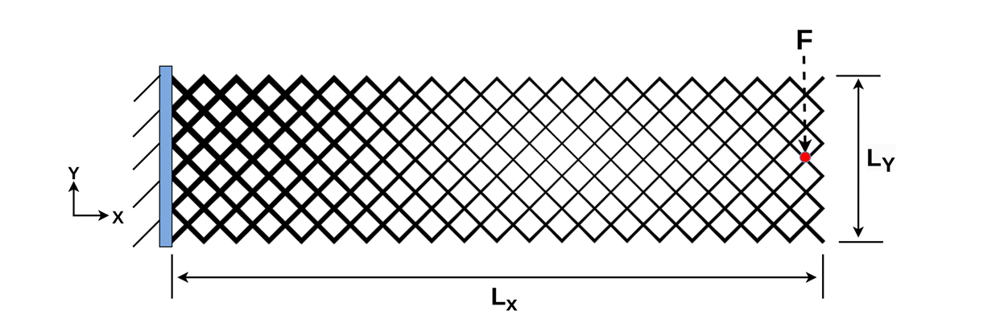
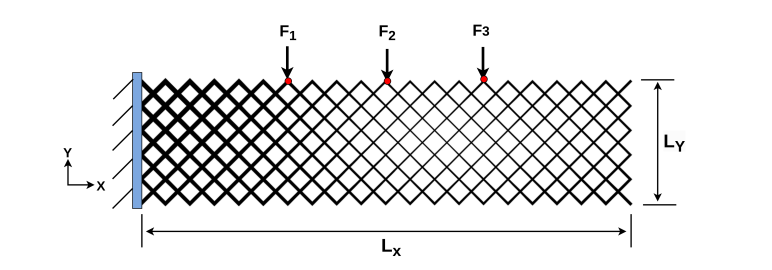
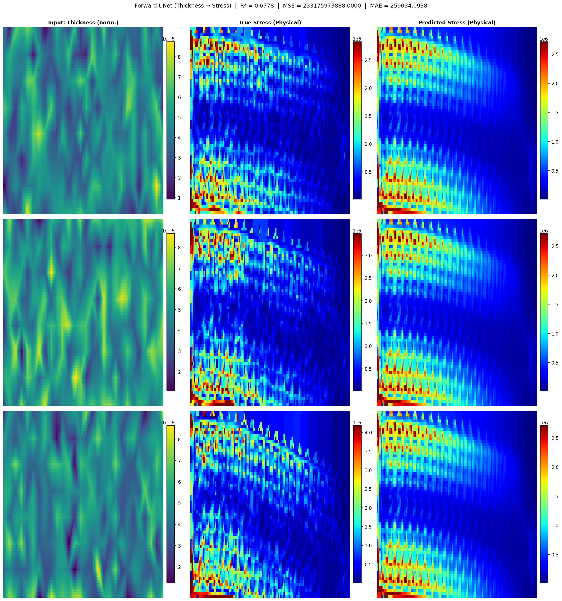
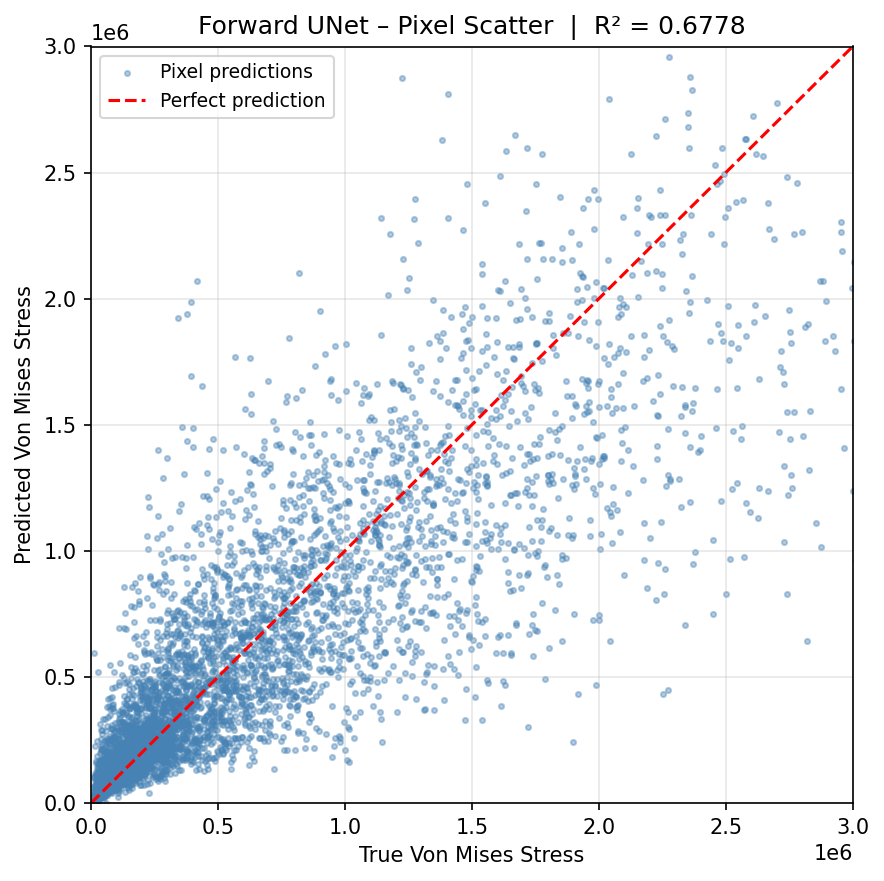
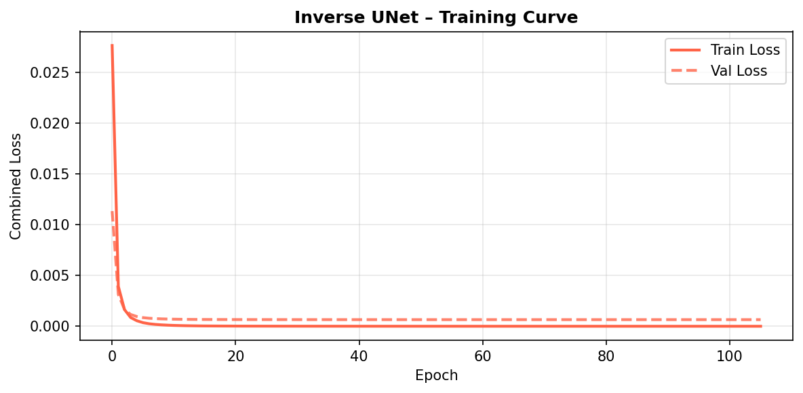
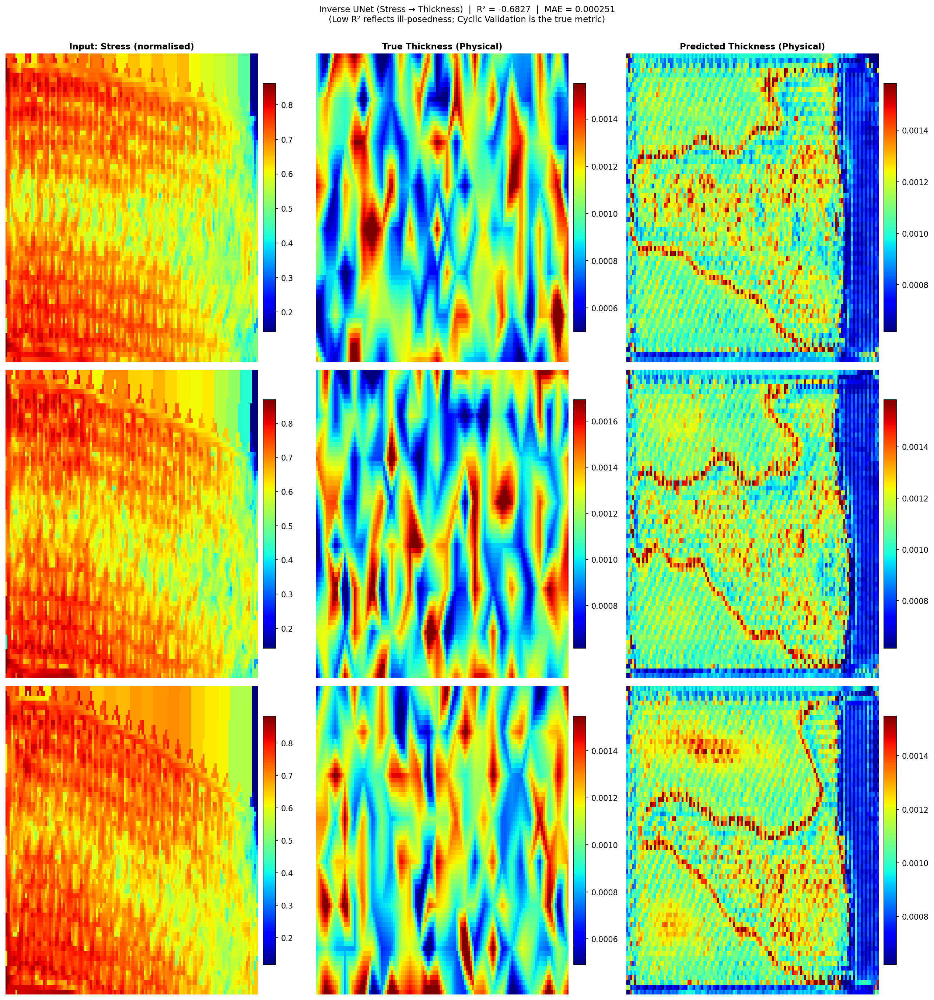
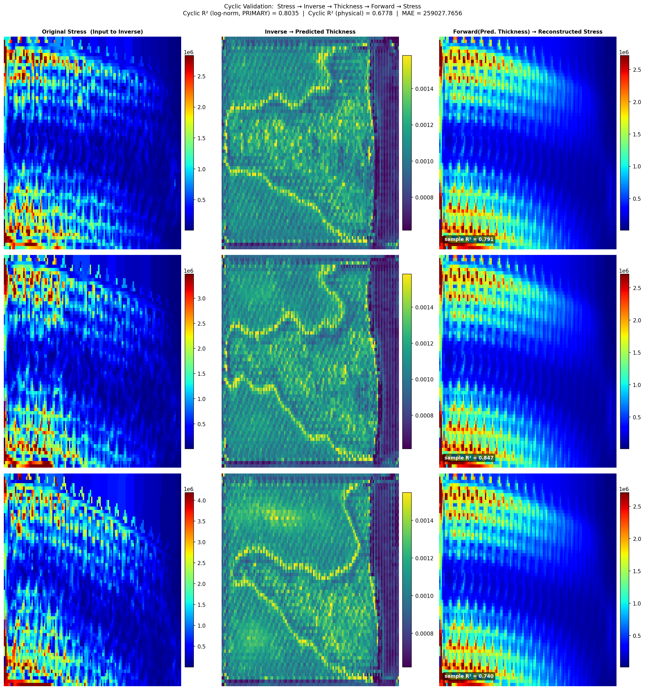
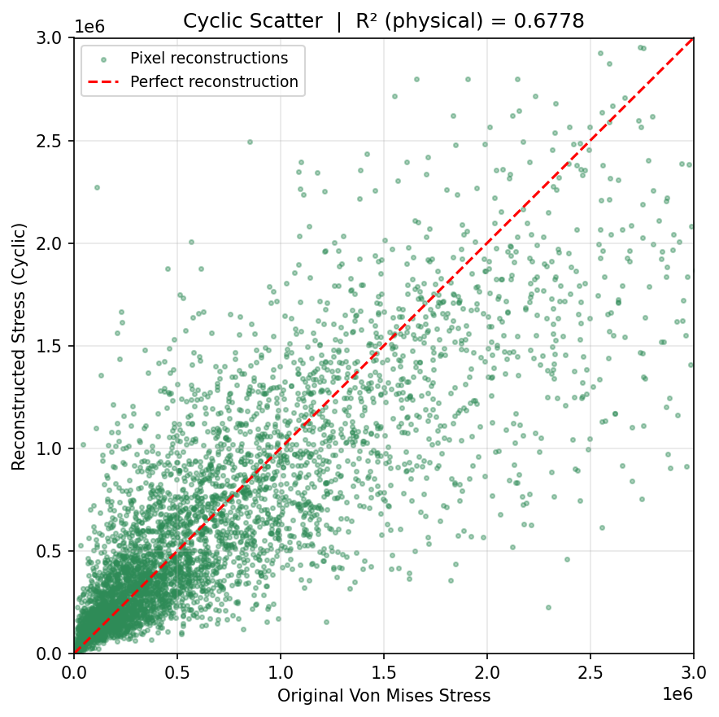

# Forward + Inverse UNet for Cantilever Beam Stress Prediction

This project looks at a cantilever beam made of centered rectangular unit cells, fixed at one edge. Every strut in the lattice can have a different thickness, and the goal is to understand how the thickness distribution across the structure affects the resulting Von Mises stress field.

The repository covers two variants of this problem, kept as fully separate, independently runnable sub-projects:

| Sub-project | Problem | Load Configuration |
|---|---|---|
| [`Fixed_load/`](#fixed_load--problem-1a) | Problem 1a | A single point load at the mid-right edge, fixed location and magnitude across the entire dataset. Only the strut-thickness distribution varies. |
| [`Variable_loads/`](#variable_loads--problem-1b) | Problem 1b | Three point loads (`F1`, `F2`, `F3`) at the top edge, with both location and magnitude varied alongside the thickness distribution. |

<p float="left">
  
  
</p>

*Left: Problem 1a's fixed single-load setup. Right: Problem 1b's variable three-load setup.*

## What's being modeled

Two UNets are trained per sub-project:

- A **forward model** that takes a thickness distribution and predicts the Von Mises stress field.
- An **inverse model** that goes the other way — takes a stress field and predicts a thickness distribution.

The forward direction is a well-posed simulation: one thickness field always produces the same stress field. The inverse direction is not — many different thickness fields can produce nearly the same stress field, so the inverse model has no single correct answer to converge to. Because of this, its direct accuracy is expected to be low, and the real way to judge whether it learned anything useful is a cyclic check: take a stress field, run it through the inverse model to get a thickness field, then run that thickness field back through the forward model and see how close the reconstructed stress is to the original.

## Dataset

Both sub-projects share the same core dataset format:

- `output.xlsx` — 5000 rows, 226 columns. Each row is one strut-thickness profile, one value per node.
- `stress/` — 5000 text files, one per row of `output.xlsx`. Column 1 is Von Mises stress, columns 2 and 3 are the deformed X and Y coordinates.
- `cord.txt` — X and Y coordinates of the undeformed structure, used to lay out the 226 node positions.

`Variable_loads/` additionally includes:

- `loaddata/` — 5000 text files tracking, per sample, the node number(s) each load was applied at and its magnitude.

Both the thickness values and the stress values are scattered points, so they get interpolated onto a shared 64×128 pixel grid before being fed into the UNets as images.

> The raw datasets (thousands of stress/coordinate text files) are too large for GitHub and are excluded via `.gitignore`. Download them separately and extract into the matching folder before running anything:
>
> **[ Insert cloud storage link here ]**
>
> - Problem 1a → extract into `Fixed_load/dataset/`
> - Problem 1b → extract into `Variable_loads/dataset/` (including `loaddata/`)

## Repository Structure

```
FORWARD_INVERSE_UNET/
├── .git/
├── .gitignore
├── README.md
├── requirements.txt              # Shared dependencies for both sub-projects
├── venv/                         # Virtual environment (Windows/Linux/macOS) — not tracked
├── venv_wsl/                     # Virtual environment (WSL, for GPU) — not tracked
│
├── Fixed_load/                    # Problem 1a
│   ├── beam.png
│   ├── dataset/                   # ⚠ NOT tracked — see Dataset section above
│   │   ├── output.xlsx
│   │   ├── cord.txt
│   │   └── stress/
│   ├── src/
│   │   ├── config.py
│   │   ├── utils.py
│   │   ├── data_processing.py
│   │   ├── unet_architecture.py
│   │   ├── forward_model.py
│   │   ├── inverse_model.py
│   │   └── cyclic_validation.py
│   ├── outputs/                   # ⚠ NOT tracked — fresh plots/weights every run
│   │   ├── models/
│   │   ├── forward/
│   │   ├── inverse/
│   │   └── cyclic/
│   ├── results/                   # Curated plots from the best run — committed, shown below
│   │   ├── forward/
│   │   ├── inverse/
│   │   └── cyclic/
│   └── main.py
│
└── Variable_loads/                 # Problem 1b
    ├── beam.png
    ├── dataset/                    # ⚠ NOT tracked — see Dataset section above
    │   ├── output.xlsx
    │   ├── cord.txt
    │   ├── stress/
    │   └── loaddata/
    ├── src/
    │   ├── config.py
    │   ├── utils.py
    │   ├── data_processing.py
    │   ├── unet_architecture.py
    │   ├── forward_model.py
    │   ├── inverse_model.py
    │   └── cyclic_validation.py
    ├── outputs/                    # ⚠ NOT tracked
    │   ├── models/
    │   ├── forward/
    │   ├── inverse/
    │   └── cyclic/
    ├── results/
    │   ├── forward/
    │   ├── inverse/
    │   └── cyclic/
    └── main.py
```

`outputs/` is where a run of `main.py` writes plots and model weights fresh every time. `results/` holds the plots picked out from the best run — the ones that actually get committed and shown in this README.

## Setup

```bash
python -m venv venv
venv\Scripts\activate
python -m pip install --upgrade pip
python -m pip install -r requirements.txt
```

This one environment covers both sub-projects — `requirements.txt` is shared. Download the dataset(s) as described above before running anything.

### GPU on Windows

Native Windows TensorFlow builds lost GPU support after version 2.10, so GPU acceleration now needs WSL2:

```bash
wsl --install
```

Reboot, then inside Ubuntu:

```bash
nvidia-smi
```

should show the GPU with no extra driver install needed — it rides on the existing Windows NVIDIA driver. TensorFlow currently supports Python 3.10–3.13, so if Ubuntu's default Python is newer:

```bash
sudo add-apt-repository ppa:deadsnakes/ppa -y
sudo apt update
sudo apt install python3.12 python3.12-venv python3.12-dev -y
```

Then set up the environment and install TensorFlow with CUDA support:

```bash
cd /mnt/d/FORWARD_INVERSE_UNET
python3.12 -m venv venv_wsl
source venv_wsl/bin/activate
pip install --upgrade pip
pip install tensorflow[and-cuda]
pip install -r requirements.txt
```

Check it worked:

```bash
python -c "import tensorflow as tf; print(tf.config.list_physical_devices('GPU'))"
```

## Running

Each sub-project uses relative paths and must be run from *inside* its own directory — not from the repository root.

```bash
# Problem 1a
cd Fixed_load
python main.py
```

```bash
# Problem 1b
cd Variable_loads
python main.py
```

This loads and grids the data, trains the forward UNet, trains the inverse UNet, then runs the cyclic validation loop and saves every plot along the way.

The forward model uses a combined loss — MSE plus MAE plus a gradient penalty term that specifically targets sharp stress concentrations, which turned out to matter more than either loss alone for getting a clean stress field. Before training the inverse model, the random seed gets reset so its dropout layers start from a fresh state rather than whatever was left over from training the forward model.

For the cyclic check, the inverse model's output gets clipped to [0, 1] before being fed back into the forward model, since the forward model was only ever trained on inputs in that range. R² is reported in two spaces — log-normalized, which is the primary number since it isn't skewed by the long tail of high-stress values, and physical space, kept mainly for comparison.

## Results

### Fixed_load (Problem 1a)

**Forward UNet**






**Inverse UNet**





**Cyclic Validation**





### Variable_loads (Problem 1b)

**Forward UNet**


**Inverse UNet**


**Cyclic Validation**


*(Populated automatically once `Variable_loads/main.py` has been run — same file names as above, generated under `Variable_loads/results/`.)*

## Notes on Git-ignored folders

The following are intentionally excluded from version control via `.gitignore` in both sub-projects:

- `dataset/` — raw data, far too large for Git; see [Dataset](#dataset) above
- `outputs/` — generated model checkpoints and plots; fully regenerable by re-running `main.py`
- `venv/`, `venv_wsl/` — local virtual environments

If you're setting this up on a new machine, only `dataset/` needs to be manually downloaded and placed — everything else regenerates on its own.